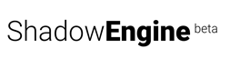
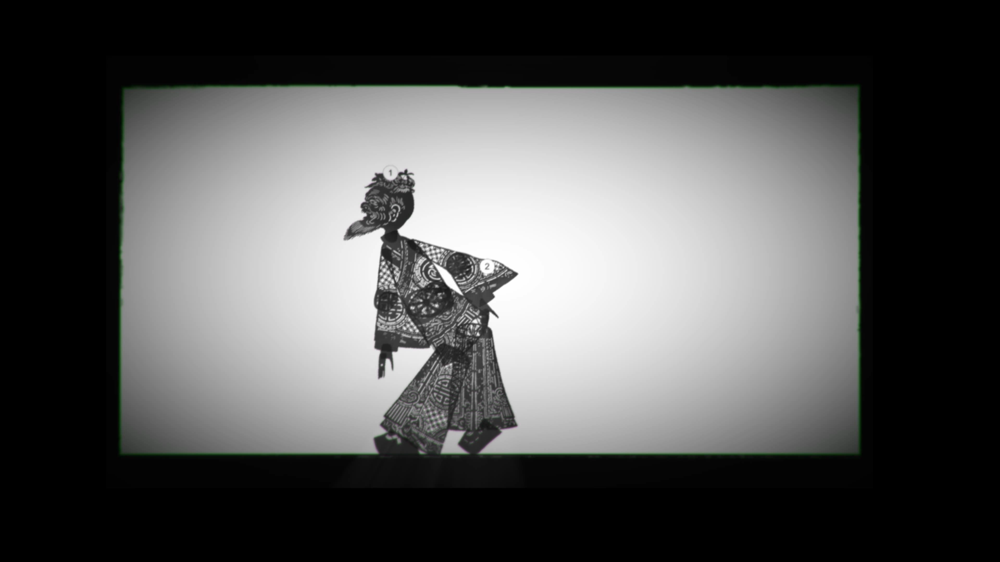

##  ##

## PhD ##

PhD - A master repository containing all the main Unity projects. You can read full descriptions of each by visiting each project on github.
The Unity 4 projects were originally built with Unity Pro, with versions 1 through to the current release. I include the most stable and evolved releases in the PhD submission. These projects are frozen at the point of submission. Development continues.
 
## Unity Projects ##

Springies 2012 [github.com/iboy/phd_springies_2011](https://github.com/iboy/phd_springies_2011 "Foundations - Play with spring dynamics, in combination with user interaction and rigid body objects. Created in Unity Pro 4 (2011) Updated to Unity 4.6.7")

Softbodies 2012 [github.com/iboy/phd_softbodies_2012](https://github.com/iboy/phd_softbodies_2012 "Foundations - Play with soft body dynamics, in combination with user interaction and rigid body objects.")

Shadow**Engine** 002: 2012 [github.com/iboy/phd_shadowengine_002_2012](https://github.com/iboy/phd_shadowengine_002_2012 "PhD Projects - ShadowEngine 002 2010-2012. Software: Unity 4.7.2 - Original multitouch iPad prototype. Figures: Karaghiozis; a Reiniger's Magic Horse;  Reiniger's female figure; Wayang Kulit (Java).")

Shadow**Engine** 003: 2013 [github.com/iboy/phd_shadowengine_003_2013](https://github.com/iboy/phd_shadowengine_003_2013 "PhD Projects - ShadowEngine 003 - 2013 - Unity Pro 4.7.2 Project. Features: Early Billy Waters, Karagöz, UniOSC touch control, animated sets.")

Shadow**Engine** 004: 2014 [github.com/iboy/phd_shadowengine_004_2014](https://github.com/iboy/phd_shadowengine_004_2014.git "Highlights: Your Fry, Billy Waters, IIM Karagöz, UniOSC, other FX.")

Shadow**Engine** 055: 2017 [github.com/iboy/phd_shadowengine_0055_2017](https://github.com/iboy/phd_shadowengine_0055_2017 "PhD Projects - Major redesign of UI for remote control. Also contains all the figures documented for the Movement and Control experiments.")

The most recent addition to the shadow**engine**. A Chinese male figure (from Chengdu) animated in the shadow**engine**.

Source image adapted and used with permission of Annie Katsura Rollins 
URL: [https://www.chineseshadowpuppetry.com](https://www.chineseshadowpuppetry.com "Chinese Shadow Puppetry")